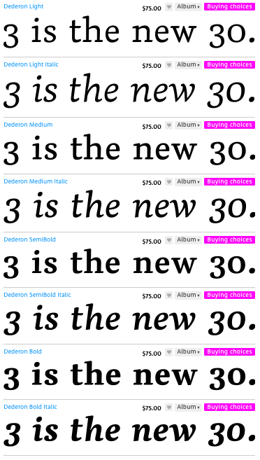
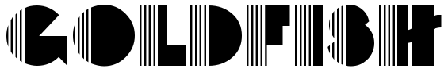

# Logo's & Treatments

## Direction

Going off the Retro and agnostic look and feel, we can start with logo treatments that use fonts. These are retro fonts found in the internet related search.

## Retro Sites, Inspiration

In order of best user experience.

1. [https://rule-of-three.co.uk/](https://rule-of-three.co.uk/)
	* This site is both minimal and complex at the same time. 
	* Wonderful mobile-first minimal experience
2. [https://caavadesign.com/](https://caavadesign.com/)
	* Super minimal
	* Assets and design do most of the talking
	* Custom HTML elements
	* Lightweight
3. [http://y78.fr/](http://y78.fr/)
	* Just... GOD!!!
	* Everything about this user experience in desktop is perfect
	* Also a digital agency.
4. [https://symbio.agency/work](https://symbio.agency/work)
	* Great-minimal look for another digital agency.
5. [http://passage.spb.ru/en/](http://passage.spb.ru/en/)
	* The assets here have a wonderful feel
	* This site only exemplifies the retro look and feel in imagery used
	* Usability-wise, this is a complete downgrade from the aforementioned
6. And always, take inspiration from: [http://www.hugeinc.com/](http://www.hugeinc.com/)

## Treatments

The look and feel I'd like to target is captured in the images below. They're retro, effective, minimal, ads from an older era. This style is definitely going to be a trend for the remainder of the fashion year. 

### Daft Punk Ad

### American Airlines Ad

### Retro Article

## Fonts

### Master

For readability, default for non-brand text, headers, paragraphs and elements.

[Deredon](http://www.myfonts.com/fonts/suitcase/dederon-serif/)

### Logo Type (Ideas Draft 0.0.1)

In no particular order.

#### [Buenos Aires](http://www.1001fonts.com/buenos-aires-nf-font.html)

* We can revisit the padding and width of this font to make it wider, etc.

#### [Backstage Passa](http://www.1001fonts.com/backstage-passa-font.html)

#### [Daddy Long Legs](http://www.1001fonts.com/daddy-longlegs-nf-font.html)

#### [Theamine](http://www.1001fonts.com/thiamine-font.html)

#### [Budmo](http://www.1001fonts.com/budmo-font.html)

#### [Johanneke](http://www.1001fonts.com/johanneke-pro-font.html)

