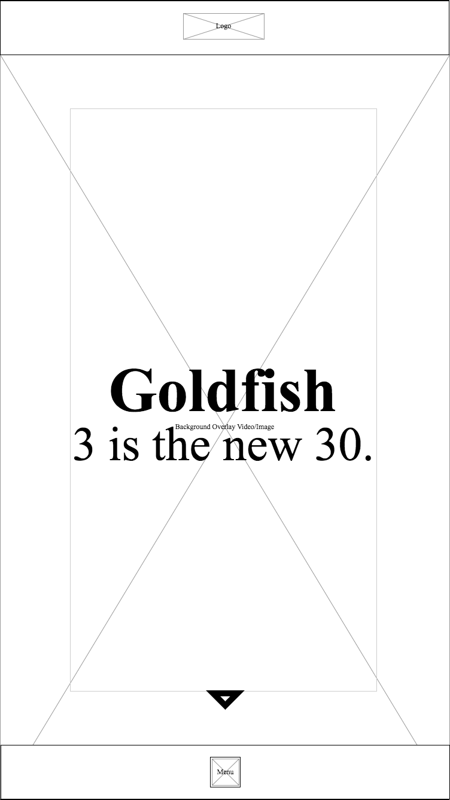
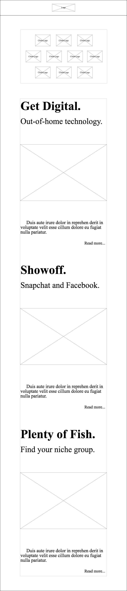
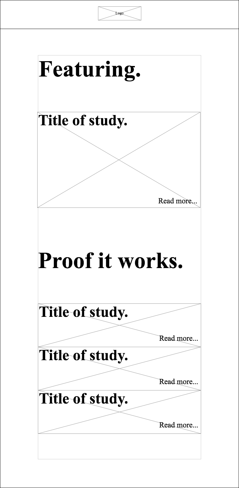
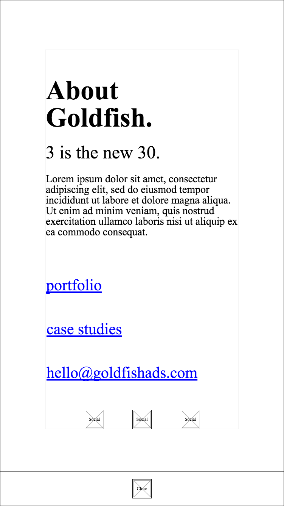

# Wireframes

[Screen-sizes reference](http://screensiz.es/)

## Legend

## Mobile First Design

### Invision

[View in browser](https://invis.io/N2EM88BVF)

### Dimensions

[Devices Covered](http://screensiz.es/phone)

*(min-max)*

| Width | Height |
| --- | --- |
| 320-2960 | 1920-2560 |

### Home Page

* Fixed header
* Fixed menu icon
* Tag line or brand name can marquee or animate
* The background can be an image or video

### Portfolio Section

* Fixed header
* Fixed menu icon
* 10 client logos
* 3 Ad-Type Exposés 

### Case Studies Section

* Fixed header
* Fixed menu icon
* 1 featured study
* 2-3 Standard posts

### Menu

* Fixed close icon
* About us
* 3 anchor links
* Social links

